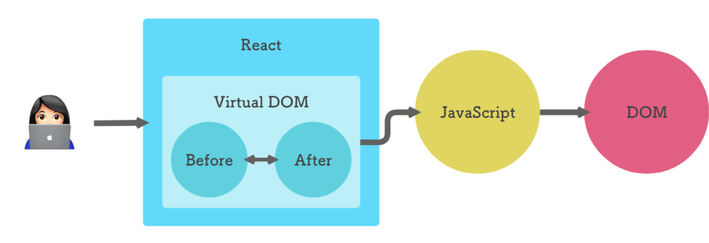
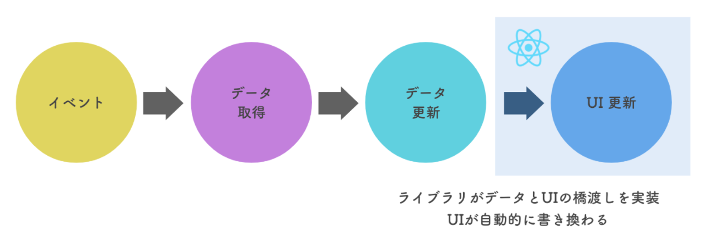
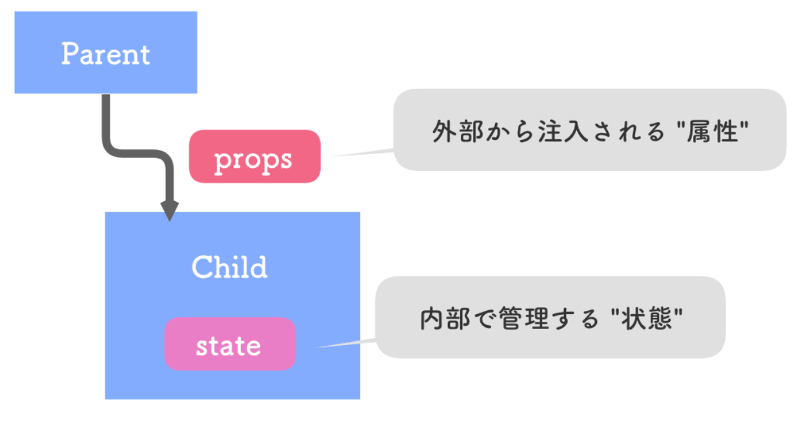
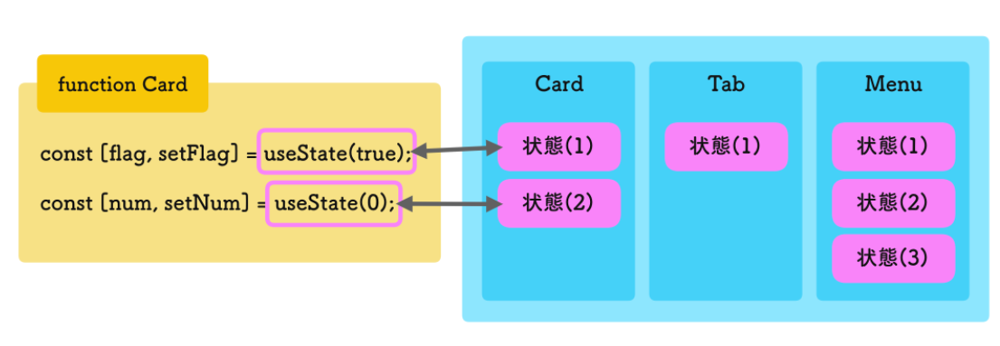

 React入門チュートリアル
https://www.hypertextcandy.com/

# Reactとは何か

## Reactとは
コンポーネント指向で、DOM操作を効率的に行うライブラリ。
- 仮想 DOM（Virtual DOM）
- データと UI の同期

## 仮想DOM
Reactはデータの更新を検知して、DOMの差分を計算して処理をする。 



## データとUIの同期
Reactが管理するprops(属性)やstate(状態)などのデータを更新すれば、
あとはReactが処理をしてくれる。  



## コンポーネント指向
UIとデータをまとめたコンポーネントを作成し、組み合わせていく。
```jsx
<Card>
    <Avatar userName="John" icon="/images/john.png">
    <Title>...</Title>
</Card>
```


# JSX
Reactの基本となるAPIはJSX, props, useState, useEffectの4つ。  

## createElement
要素を作成するメソッド ``React.createElement``  
|   |      型         |       説明      |
|---|-----------------|------------------|
|引1|	文字列         |	要素名    |
|引2|	オブジェクト   |	属性      |
|引3|	文字列 or 配列 |    子要素    |
|返|	React要素      |    要素      |

```js
const element = React.createElement('p', { id: 'text' }, ['hello world']);
```

特定のHTMLの中に作成したReact要素を描画するメソッド ``ReactDOM.render``  
|   |          型    |               説明              |
|---|----------------|---------------------------------|
|引1|	React要素    |	              要素              |
|引2|	HTML要素     |	 React要素を内部に描画する親要素 |
|返 |	             |                                  |

```js
    const root = document.getElementById('root');

    ReactDOM.render(element, root);
```

## JSX
### jsxはcreateElementである
JSXはBabelを利用してJavaScriptに変換する必要がある。   
JSX記法:
```jsx
const element = <p id="the-text" className="text">hello world</p>;
```

### Fragment
JSXには単一のルート要素を持たせる。
```js
//error
const element = (
    <article>...</article>
    <aside>...</aside>
)
// ok
const element = (
    <>
        <article>...</article>
        <aside>...</aside>
    </>
)
```

### 値を埋め込む
{}で括られた箇所はJavaScriptとして解釈される。(式のみ書ける)
```js
const name = "John";
const element = <p>hello, {message}</p>;
// <p>hello, John</p>

//error 文は書けない
<p>{if(hello) return 'hello'}, world</p>
//ok
<p>{hello && 'hello'}, world</p>
<p>{hello ? 'hello' : 'goodbye'}, world</p>
```

### リスト描画とkey
繰り返し生成される要素にはkeyプロパティが必要。  
別のループ箇所と値が重複しても良い。  
<>にkeyが必要な場合<React.Fragment>と明記する。

```js
const element = (
    <div>
        {items.map(item => (
            <React.Fragment key={item.foo}>
                {item.bar}
            </React.Fragment>
        ))}
    </div>
)
```


## コンポーネントの定義
コンポーネントと呼ばれる独自要素を
関数として定義できる。  
条件:
- 関数名は大文字で始める
- React要素(またはnull)を返す  

|  |       型           |                  説明              |
|--|--------------------|------------------------------------|
|引|     オブジェクト    | 属性値をまとめたオブジェクト(props) |
|返| React要素 or null  |                                    |


```js
const Component = (props) => {
    return <p id={props.id} className="text">{props.children}</p>;
}
//props.childrenで子要素を渡せる

const root = document.getElementById('root');
ReactDOM.render(<Component id={"the-text"}>Hello world</Component>, root);
```


## JSXの意義
- HTML要素とReactコンポーネントを透過的に扱える  
インターフェースに統一性があるからコードが散らからない。

- 宣言的にUIを記述できる
手続き的だと「結局どうなるか」がわかりにくい。  
宣言的だと「あるデータによって、どのようなDOMが生成されるか」が書かれていて最終形がわかりやすい。


# 属性と状態
stateが更新されると、それを管理するコンポーネントが再レンダリングされる。

## コンポーネントツリーとデータ
- props: 親から子へ渡される属性値
- state: 子の内部状態  
子はpropsを更新できない。  
親は子のstateを直接参照、更新できない。  
あるコンポーネントのstateが更新され再レンダリングされると
そこから呼ばれているコンポーネントも再レンダリングされる。


## props
なんでも渡せる
```js
<Component string="foo" number={123} array={[1,2,3]} object={{hoge: 'baz'}}/>
```
### イベント処理
Reactにおけるイベント処理は、onClickなどのpropsに関数を渡して実現。
```js
    const handleClick = () => {
        // do something..
    };
    const button = <button onCLick={handleClick}>click!</button>;
```


## state
コンポーネントの内部でデータを管理したいときに``useState``を使う
useStateは「状態(State)」というデータを持つ。  
初回の実行時は引数の初期値が用いられるが、  
2回目以降は更新された値を返す。  
Reactが関数の状態を保持している。

|  |  型  |     説明        |
|--|------|------------------|
|引|  *   |    状態の初期値  |
|返| 配列 |[0]: 状態を参照する変数 <br> [1]: 状態を更新するための変数 |

```js
const countState = React.useState(0); //初期値:0
const count = countState[0]; //状態を参照する変数
const setCount = countState[1]; //更新する関数
//スプレッド構文で代入するのが一般的
const [count, setCount] = React.useState(0);
```

## フック(Hook)
Hookとは、Reactの便利な機能を導入できるヘルパー関数群。
``useState``はフックの1つ。DOM更新を自動化してくれるstateを使えるようにする。
フック関数を実行できる場所にはルールがある。
- フックを呼び出すのはトップレベルのみ
- フックを呼び出すのはReactの関数内のみ

Reactは内部で呼び出し順によってstateの値を管理しているため、
トップレベルのみ つまり条件分岐やループの中では使ってはいけない。  
フックが実行される回数は、レンダリングごとに同一でなければいけない。  



# フォームとイベントハンドリング
## フォーム(ネイティブイベント)
### テキスト
フォーム入力は入力値を保管する``state``と``onChange``でstateを更新するイベントハンドラを組み合わせて実装する。
```js
const App = () => {
    const [name, setName] = React.useState('Hoge');
    const handleChange = e => setName(e.target.value);
    return (
        <input value={name} onChange={handleChange} />
    )
}
```

### ラジオボタン
``checked``の値を明示的に判定する必要がある。
```js
const App = () => {
    const [val, setVal] = React.useState('cat');
    const handleChange = e => setVal(e.target.value);
    return (
        <>
            <label>
                <input type="radio" value="cat" onChange={handleChange} checked={val === 'cat'} />
                猫派
            </label>
            <label>
                <input type="radio" value="dog" onChange={handleChange} checked={val === 'dog'} />
                犬派
            </label>
        </>
    )
}
```
### チェックボックス
複数選択になるため入力値は配列で保持するとよい
```js
const App = () => {
    const [val, setVal] = React.useState(['js']);
    const handleChange = e => {
        if(val.includes(e.target.value)) {
            //すでに含まれていたらイベント発行元を除いた配列をsetする
            setVal(val.filter(item => item !== e.target.value));
        } else {
            //イベント発行元を末尾に加えた配列をsetする
            setVal([...val, e.target.value]);
            //stateは直接編集できないから val.push(e.target.value)は NG
        }
    };
    return (
        <>
        <label>
            <input type="checkbox" value="js" onChange={handleChange} checked={val.includes('js')}></input>
            JavaScript
        </label>
        <label>
            <input type="checkbox" value="python" onChange={handleChange} checked={val.includes('python')}></input>
            Python
        </label>
        <label>
            <input type="checkbox" value="kotlin" onChange={handleChange} checked={val.includes('kotlin')}></input>
            Kotlin
        </label>
        </>
    )
};
```
### セレクトボックス
``<select>``のvalueに入力値を指定する。

```js
const App = () => {
    const [val, setVal] = React.useState('react');
    const handleChange = e => setVal(e.target.value);
    return (
        <>
            <select value={val} onChange={handleChange}>
                <option value="react">React</option>
                <option value="vue">Vue.js</option>
                <option value="angular">Angular</option>
            </select>
        </>
    )
}
```

## コンポーネントのイベント処理
子は親のstateを直接更新できないが、  
親が定義した関数を介して更新できる。
```js
//NG
const Parent = () => {
    const [val, setVal] = React.useState(0);
    return <Child value={val} />;
}
const Child = ({ value }) => {
    value = 123;
}
//OK
const Parent = () => {
    const [val, setVal] = React.useState(0);
    const handleUpdate = value => setVal(value);
    return <Child onUpdate={handleUpdate} />;
}
const Child = ({onUpdate}) => {
    onUpdate(123);
}
```

# ToDoアプリを作ってみよう
## コンポーネント設計
- コンポーネントをどのように分けるか
- それぞれはどのような属性(props)を受け取って、どのような状態(state)を管理するか。

ハンドラに引数を渡すための``bind``を使ったテクニック
```js
//ベントハンドラに引数を渡したいときにどうするか？
<Comp onSomething={doSomething} />
// NG ここで実行してしまう
<Comp onSomething={doSomething(123)} />
// OK アロー関数で渡しても良い
<Comp onSomething={() => doSomething(123)} />
// OK bindを使う
<Comp onSomething={doSomething.bind(null, 123)} />
```

# 副作用
## 副作用とは
「副作用(side effect)」とはUIの構築 (JSX返却、状態やイベントハンドラ定義) 以外の処理のこと。  フック関数``useEffect``を通して実行する
- DOMの存在を前提とした処理(更新、参照)
- 状態(state)の更新

```js
const Component = () => {
    //ここはダメ
    someSideEffects(); //副作用
    React.useEffect(() => {
        //ここならOK
        someSideEffects(); //副作用
    }, [])
}
```

useEffect内で実行する理由
- DOMを参照するにはReactによってDOMが作られるまで待つ必要があるため。
- 状態の更新により再レンダリングが発生するため無限ループを避ける必要があるため  

useEffectに渡したコールバック関数はレンダリングが完了した後に実行される。

```js
const Component = () => {
    const [val, setVal] = React.useState(0);
    // NG 無限ループが発生
    setVal(123);
    // OK 初回レンダリングのときのみ実行される。
    React.useEffect(() => {
        new ExternalLibrary('.target-class');
        setVal(123);
    }, []);
    return (
        //JSX...
    )
}
```

## useEffect
``useEffect``は副作用の実行のためにReactが提供するフック関数。  
そのコンポーネントがレンダリングされた直後に実行される。
|引数 | 型   |説明                                                    |
|--   |---   |------                                                  |
|  1  |関数  |副作用の処理内容<br>何も返さないorクリーンアップ関数を返す |   
|  2  |配列  |既存データ(省略可能)<br>第一引数の実行タイミングを制御する |   

```js
React.useEffect(() => {
    document.title = 'Hello world';
}, []);
```

### データと副作用の同期
実行条件の3パターン
1. レンダリング後に必ず実行
1. 初回のレンダリング後のみ実行
1. 指定したデータに変更があった場合のみ実行(props, stateが大抵)
```js
//初回のみ
React.useEffect(() => {
    //...
});
//初回のみ (空の配列を渡す)
React.useEffect(() => {
    //...
}, []);
//渡した変数に変更があったときのみ
React.useEffect(() => {
    document.title = `Welcome, ${username}!`;
}, [userName]);
//渡した変数に変更があったときのみ(複数データを指定)
React.useEffect(() => {
    document.title = `Welcome. ${firstName} ${lastName}!`;
}, [firstName, lastName]);
```
コールバック内で参照している``props, state``などの値はすべて配列に入れておくと良い。

### クリーンアップ関数
``useEffect``のコールバックから返された関数のこと。  コンポーネントがアンマウント(DOMから削除)されるたびに呼び出される。  
イベントを登録している場合、非同期通信をsubscribeしているい場合などに使う。
```js
React.useEffect(() => {
    const handler = () => {
        //...
    }
    window.addEventListener('resize', handler);
    return () => {
        // コールバック関数
        window.removeEventListener('resize', handler);
    }
}, []);
```

## 非同期処理
受け取ったpropsを元に、UI構築に必要なデータをAPIから取得するサンプル
```js
const User = ({userId}) => {
    const [user, setUser] = React.useState(null);
    React.useEffect(() => {
        fetch(`/api/users/${userId}`)
            .then(res => res.json())
            .then(json => setUser(json));
    }, [userId]);
    return user ? <h1>Hello, {user.name}</h1> : <p>Loading...</p>

    // async/awaitを用いる場合
    // async関数の仕様で返却値が指定されていない場合、暗黙的にPromiseオブジェクトが返されるが
    // コールバックからは関数を返すor何も返さない(undefined)必要があるため
    // コールバック内でasync関数を定義してそれを実行させる(即時実行関数)
    React.useEffect(() => {
        (async function fetchUser() {
            const response = await fetch(`/api/users/${userId}`)
                .then(res => res.json());
            setUser(response);
        })();
        }, [userId]);
}
```

# カスタムフック
カスタムフック作成のメリット
- UIと切り離したロジックの抽出を可能にする
- コンポーネント関数の肥大化を抑える
- 複数のフック呼び出しを論理的な単位でまとめられる

## カスタムフックの作成
関数名が``use``で始まり、他のフック関数を含む関数はカスタムフックとみなされる
フック関数を含むロジックを抽出するときは、カスタムフックを作成する  
一連の処理をコンポーネントから分離して抽象化したい場合にカスタムフックを作成する必要がある

```js
const useHooks = (props) => {
    const [items, setItems] = useState();
    React.useEffect(() => {
        // ...
    });
    return items;
}

const App = () => {
    const items = useHooks();
    // ...
}
```

# Reactプロジェクトを始める方法
## ディレクトリ構成
``public``と``src``ディレクトリが作成される
- public
ビルド時に加工なしに公開されるファイルを置く場所  
``index.html``は例外で、ビルド時にJavaScriptファイルを読み込む``<script>``要素の挿入などが行われる
- src
トランスパイルやバンドルを行うソースコードを置く場所

## コンポーネント
``src/components``ディレクトリにコンポーネントを格納する  
メソッドごとにインポートできるから``React.useState``が``useState``と書ける  
```js
// src/components/Todo.js
import React, { useState } from 'react';
const Todo = () => {
    const [filter, setFilter] = useState('ALL');
}
export default Todo;
```

## カスタムフック
``hooks``ディレクトリにカスタムフックを置く

## スタイルシート
``src/styles``ディレクトリにスタイルシートを格納する
```css
/* src/styles/main.css */
@import url('https://cdnjs.cloudflare.com/ajax/libs/bulma/0.8.2/css/bulma.min.css');
.container {
    margin-top: 2rem;
}
```
スタイルシートもJavaScriptと同様にインポート可能
sassのサポートもある
```js
import './styles/main.css';
```

## ユニットテスト
Testing Libraryというテストコードを書くためのヘルパーライブラリが内蔵されている  
3つがプリセットされている
|パッケージ|概要|
|---|---|
|@testing-library/react| Reactコンポーネントをテストするためのヘルパー関数群|
|@testing-library/jest-dom|Jestマッチャー関数のDOM向け拡張|
|@testing-library/user-event|複雑なユーザーイベントのシミュレーションライブラリ|
```sh
$ npm run test
```

## リンター
リンター(ESLint)もデフォルトで付属している
リンターとは、静的解析、つまりコードを実行前に不審な点を分析する機能
```js
const App = () => {
    const test = 123;
    return (
        <div>
            <Todo />
        </div>
    )
}
```
ファイルを保存すると以下の警告が出る。
```sh
Compiled with warnings.
./src/App.js
Line 6:9:  'test' is assigned a value but never used  no-unused-vars
```